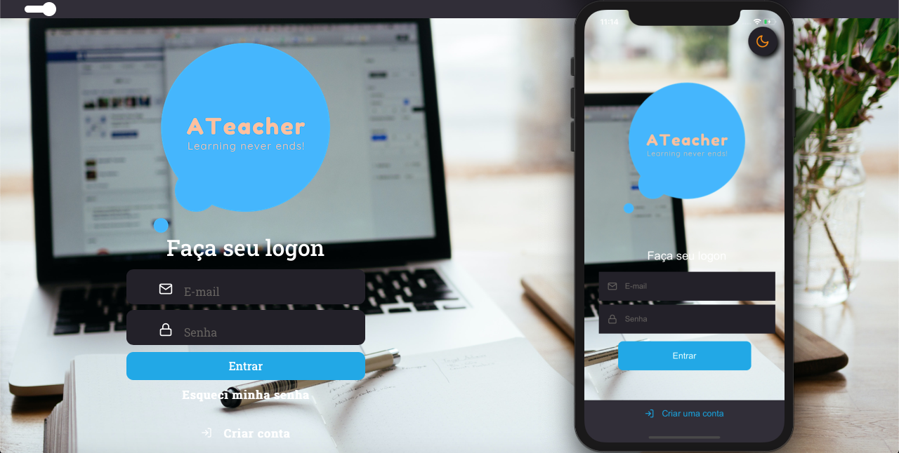
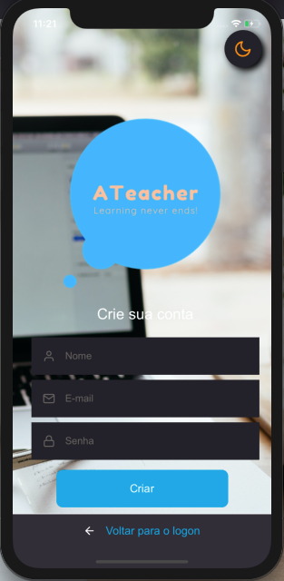

<h1 align="center">Yet in development!</h1>

<h1 align="center">
  
</h1>
<br/>
<h1 align="center">
  
</h1>

<h1 align="center">Repository with Frontend, Backend and Mobile of the ATeacher project.</h1>
<h3>See below, within access to each module of the project within its respective session, being Frontend, Backend and Mobile.</h3>

## **Clone the FullStack version project and access the folder**

<h1>Backend</h1>
<h3 align="center">
  Express Application for ATeacher project
</h3>

<p align="center">
  

  <a href="https://www.linkedin.com/in/vinicius-prudencio-64bb99128/" target="_blank" rel="noopener noreferrer">
    
  </a>

  

  <a href="https://github.com/Vynny21/fastfeet-frontend/commits/dev">
    
  </a>

  <a href="https://img.shields.io/github/issues/Vynny21/fastfeet-frontend?color=yellow">
    
  </a>

  
</p>

<p align="center">
  <a href="#%EF%B8%8F-about-the-project">About the project</a>&nbsp;&nbsp;&nbsp;|&nbsp;&nbsp;&nbsp;
  <a href="#-technologies">Technologies</a>&nbsp;&nbsp;&nbsp;|&nbsp;&nbsp;&nbsp;
  <a href="#-getting-started">Getting started</a>&nbsp;&nbsp;&nbsp;|&nbsp;&nbsp;&nbsp;
  <a href="#-how-to-contribute">How to contribute</a>&nbsp;&nbsp;&nbsp;|&nbsp;&nbsp;&nbsp;
  <a href="#-license">License</a>
</p>


## 💇🏻‍♂️ About the project

<p align="center">ATeacher - Find a private teacher anywhere!</p>

This api is manage ATeacher app, developed with Typescript, NodeJs, Express, TypeORM, Postgres e JWT.

## 🚀 Technologies

Technologies that I used to develop this api

- [Node.js](https://nodejs.org/en/)
- [TypeScript](https://www.typescriptlang.org/)
- [Express](https://expressjs.com/pt-br/)
- [Multer](https://github.com/expressjs/multer)
- [TypeORM](https://typeorm.io/#/)
- [JWT-token](https://jwt.io/)
- [uuid v4](https://github.com/thenativeweb/uuidv4/)
- [PostgreSQL](https://www.postgresql.org/)
- [Date-fns](https://date-fns.org/)
- [Jest](https://jestjs.io/)
- [SuperTest](https://github.com/visionmedia/supertest)
- [Husky](https://github.com/typicode/husky)
- [Commitlint](https://github.com/conventional-changelog/commitlint)
- [Commitizen](https://github.com/commitizen/cz-cli)
- [Eslint](https://eslint.org/)
- [Prettier](https://prettier.io/)
- [EditorConfig](https://editorconfig.org/)

## 💻 Getting started

Import the `Insomnia.json` on Insomnia App or click on [Run in Insomnia](#insomniaButton) button

### Requirements

- [Node.js](https://nodejs.org/en/)
- [Yarn](https://classic.yarnpkg.com/) or [npm](https://www.npmjs.com/)
- One instance of [PostgreSQL](https://www.postgresql.org/)

> Obs.: I recommend use docker

**Clone the project and access the folder**

```bash
$ git clone https://github.com/vynnydev/ateacher.git && cd ateacher

Go to the backend folder to access the API
```

**Follow the steps below**

```bash
# Install the dependencies
$ yarn

# Make a copy of '.env.example' to '.env'
# and set with YOUR environment variables.
$ cp .env.example .env

# Start the services with docker-compose
$ docker-compose up -d

# Once the services are running, run the migrations
$ yarn typeorm migration:run

# Well done, project is started!```


## 🤔 How to contribute

**Make a fork of this repository**

```bash
# Fork using GitHub official command line
# If you don't have the GitHub CLI, use the web site to do that.

$ gh repo fork vynnydev/ateacher
```

**Follow the steps below**

```bash
# Clone your fork
$ git clone your-fork-url && cd ateacher

# Create a branch with your feature
$ git checkout -b my-feature

# Make the commit with your changes
$ git commit -m 'feat: My new feature'

# With Husky
$ git commit -m 'feat(context): commit'

# Send the code to your remote branch
$ git push origin my-feature
```

After your pull request is merged, you can delete your branch

## 📝 License

This project is licensed under the MIT License - see the [LICENSE](LICENSE) file for details.

---

<h1>Frontend</h1>
<h3 align="center">
  ReactJS Application for ATeacher project
</h3>

<p align="center">ATeacher - Find a private teacher anywhere!</p>

<p align="center">
  

  <a href="https://www.linkedin.com/in/vinicius-prudencio-64bb99128/" target="_blank" rel="noopener noreferrer">
    
  </a>

  

  <a href="https://github.com/Vynny21/fastfeet-frontend/commits/dev">
    
  </a>

  <a href="https://img.shields.io/github/issues/Vynny21/fastfeet-frontend?color=yellow">
    
  </a>

  
</p>

<p align="center">
  <a href="#%EF%B8%8F-about-the-project">About the project</a>&nbsp;&nbsp;&nbsp;|&nbsp;&nbsp;&nbsp;
  <a href="#-technologies">Technologies</a>&nbsp;&nbsp;&nbsp;|&nbsp;&nbsp;&nbsp;
  <a href="#-getting-started">Getting started</a>&nbsp;&nbsp;&nbsp;|&nbsp;&nbsp;&nbsp;
  <a href="#-how-to-contribute">How to contribute</a>&nbsp;&nbsp;&nbsp;|&nbsp;&nbsp;&nbsp;
  <a href="#-license">License</a>
</p>

</br>

<p align="center">
  
</p>
<p align="center">
  
</p>
<p align="center">
  
</p>


## 💇🏻‍♂️ About the project

## 🚀 Technologies

Technologies that I used to develop this web client

- [ReactJS](https://reactjs.org/)
- [TypeScript](https://www.typescriptlang.org/)
- [React Router DOM](https://reacttraining.com/react-router/)
- [React Icons](https://react-icons.netlify.com/#/)
- [UnForm](https://unform.dev/) [💜](https://rocketseat.com.br/)
- [Yup](https://github.com/jquense/yup)
- [Styled Components](https://styled-components.com/)
- [Polished](https://github.com/styled-components/polished)
- [Axios](https://github.com/axios/axios)
- [Husky](https://github.com/typicode/husky)
- [Commitlint](https://github.com/conventional-changelog/commitlint)
- [Commitizen](https://github.com/commitizen/cz-cli)
- [Eslint](https://eslint.org/)
- [Prettier](https://prettier.io/)
- [EditorConfig](https://editorconfig.org/)

## 💻 Getting started

### Requirements

**Clone the project and access the folder**

```bash
$ git clone https://github.com/vynnydev/ateacher.git && cd ateacher
```

**Follow the steps below**

```bash
# Install the dependencies
$ yarn

# Be sure the file 'src/services/api.ts' have the IP to your API

# Start the client
$ yarn start
```

## 🤔 How to contribute

**Make a fork of this repository**

```bash
# Fork using GitHub official command line
# If you don't have the GitHub CLI, use the web site to do that.

$ gh repo fork Vynny21/events_app
```

**Follow the steps below**

```bash
# Clone your fork
$ git clone your-fork-url && cd events_app

# Create a branch with your feature
$ git checkout -b my-feature

# Make the commit with your changes
$ git commit -m 'feat: My new feature'

# Send the code to your remote branch
$ git push origin my-feature
```

After your pull request is merged, you can delete your branch

## 📝 License

This project is licensed under the MIT License - see the [LICENSE](LICENSE) file for details.

---

<h1>Mobile</h1>

<h3 align="center">
  React Native Application for ATeacher project
</h3>

<p align="center">ATeacher - Find a private teacher anywhere!</p>

<p align="center">
  
</p>
<p align="center">
  
</p>

<p align="center">Splash-Screen</p>
<p align="center">
  
</p>


<p align="center">
  

  <a href="https://www.linkedin.com/in/vinicius-prudencio-64bb99128/" target="_blank" rel="noopener noreferrer">
    
  </a>

  

  <a href="https://github.com/Vynny21/fastfeet-frontend/commits/dev">
    
  </a>

  <a href="https://img.shields.io/github/issues/Vynny21/fastfeet-frontend?color=yellow">
    
  </a>

  
</p>

<p align="center">
  <a href="#%EF%B8%8F-about-the-project">About the project</a>&nbsp;&nbsp;&nbsp;|&nbsp;&nbsp;&nbsp;
  <a href="#-technologies">Technologies</a>&nbsp;&nbsp;&nbsp;|&nbsp;&nbsp;&nbsp;
  <a href="#-getting-started">Getting started</a>&nbsp;&nbsp;&nbsp;|&nbsp;&nbsp;&nbsp;
  <a href="#-how-to-contribute">How to contribute</a>&nbsp;&nbsp;&nbsp;|&nbsp;&nbsp;&nbsp;
  <a href="#-license">License</a>
</p>

## 💇🏻‍♂️ About the project

## 🚀 Technologies

Technologies that I used to develop this mobile client

- [ReactJS](https://reactjs.org/)
- [TypeScript](https://www.typescriptlang.org/)
- [React Native](https://reactnative.dev/)
- [React Navigation](https://reactnavigation.org/)
- [React Native Vector Icons](https://github.com/oblador/react-native-vector-icons)
- [UnForm](https://unform.dev/) [💜](https://rocketseat.com.br/)
- [Yup](https://github.com/jquense/yup)
- [Styled Components](https://styled-components.com/)
- [Axios](https://github.com/axios/axios)
- [Husky](https://github.com/typicode/husky)
- [Commitlint](https://github.com/conventional-changelog/commitlint)
- [Commitizen](https://github.com/commitizen/cz-cli)
- [Eslint](https://eslint.org/)
- [Prettier](https://prettier.io/)
- [EditorConfig](https://editorconfig.org/)

## 💻 Getting started

### Requirements

- Have this application's [API](https://github.com/Vynny21/events_mobile) running

**Clone the project and access the folder**

```bash
$ git clone https://github.com/vynnydev/ateacher_mobile.git && cd ateacher_mob
OR 
$ git clone https://github.com/vynnydev/ateacher_mobile.git

```

**Follow the steps below**

```bash
# Install the dependencies
$ yarn

# Be sure the file 'src/services/api.ts' have the IP to your API

# If you are going to emulate with android, run this command
# Be sure to have the emulator open
$ yarn android

# If you are going to emulate with ios, run this command
$ yarn ios
```

## 🤔 How to contribute

**Make a fork of this repository**

```bash
# Fork using GitHub official command line
# If you don't have the GitHub CLI, use the web site to do that.

$ gh repo fork vynnydev/ateacher_mobile
```

**Follow the steps below**

```bash
# Clone your fork
# 
$ git clone your-fork-url && cd ateacher_mobile

# Create a branch with your feature
$ git checkout -b my-feature

# Make the commit with your changes
$ git commit -m 'feat: My new feature'

# Send the code to your remote branch
$ git push origin my-feature
```

After your pull request is merged, you can delete your branch

## 📝 License

This project is licensed under the MIT License - see the [LICENSE](LICENSE) file for details.

---

Made with 💜 by Vinicius Prudencio 👋 [See my linkedin](https://www.linkedin.com/in/vinicius-prudencio-64bb99128/)
